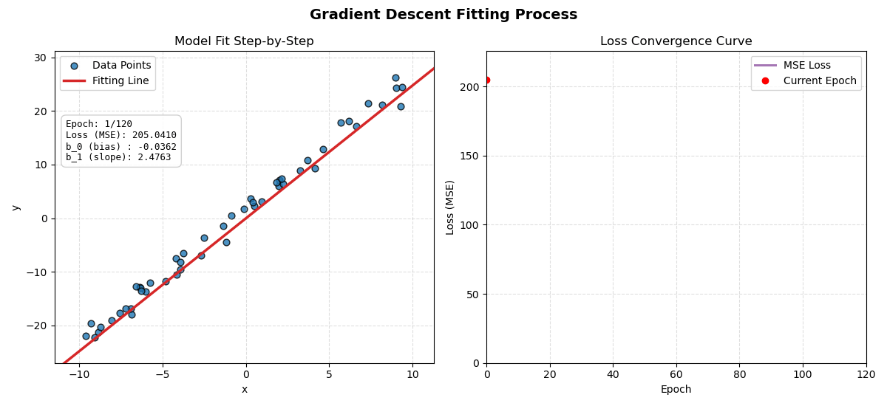

# From-Scratch Linear Regression Library

[](https://www.python.org/)
[](https://numpy.org/)
[](https://matplotlib.org/)
[](tests/test_linear.py)

A clean, modular, from-scratch implementation of **Simple Linear Regression** (Batch Gradient Descent & OLS) and **Multiple Linear Regression** (Normal Equation) in Python with NumPy and Matplotlib. Designed for educational transparency, portfolio demonstrations, and visualizing optimization mechanics step-by-step.

---

## 📽️ Gradient Descent Fitting Animation

Watch batch gradient descent optimize the regression model step-by-step starting from $(b_0=0, b_1=0)$ at Epoch 0. The plot on the left updates the fitted line in real-time with an extended **1-second hold per early epoch** for the first 5 epochs—making early line rotation and translation crystal clear—while the plot on the right tracks MSE loss reduction across epochs, complete with live parameter statistics (`Epoch`, `Loss`, `b_0`, `b_1`).



---

## ✨ Features

- **Simple Linear Regression**:
  - **Batch Gradient Descent**: Iterative parameter optimization starting from $(0, 0)$ with full history tracking (`loss_history`, `coeff_history`).
  - **Ordinary Least Squares (OLS)**: Closed-form analytical solver ($b_1 = \frac{\sum (x - \bar{x})(y - \bar{y})}{\sum (x - \bar{x})^2}$).
- **Multiple Linear Regression**:
  - Analytical **Normal Equation** matrix solver ($\theta = (X^T X)^{-1} X^T y$) supporting $n$-dimensional feature inputs.
- **Dynamic Optimization Animations (`track.py`)**:
  - Real-time Matplotlib animation with customizable pacing (`fps`, `interval`), initial epoch holding (`early_epochs_hold`, `early_epoch_seconds`), status text overlays, and end-frame linger (`pause_seconds`) so viewers can absorb final model convergence.
  - Export animations to crisp `.gif` files using Pillow.
- **Dataset Tools & Loaders**:
  - Synthetic dataset generators (`make_simple_regression`, `make_multiple_regression`).
  - Classic dataset subsets (`load_iris_regression`, `load_housing_regression`).

---

## 🧮 Mathematical Foundations

### Simple Linear Regression Model
$$\hat{y} = b_1 x + b_0$$

Where $b_0$ is the intercept (bias) and $b_1$ is the slope (weight).

### Objective Function (Mean Squared Error)
$$J(b_0, b_1) = \frac{1}{n} \sum_{i=1}^{n} \left( (b_1 x_i + b_0) - y_i \right)^2$$

### Gradient Descent Parameter Update Rules
At each epoch $t$, parameters are updated in the direction of steepest descent:

$$\frac{\partial J}{\partial b_0} = \frac{2}{n} \sum_{i=1}^{n} (\hat{y}_i - y_i)$$

$$\frac{\partial J}{\partial b_1} = \frac{2}{n} \sum_{i=1}^{n} (\hat{y}_i - y_i) x_i$$

$$b_0^{(t+1)} = b_0^{(t)} - \alpha \frac{\partial J}{\partial b_0}$$

$$b_1^{(t+1)} = b_1^{(t)} - \alpha \frac{\partial J}{\partial b_1}$$

where $\alpha$ represents the learning rate.

---

## 🚀 Quick Start

### 1. Installation

Clone the repository and install the dependencies:

```bash
git clone https://github.com/kaleb-asefa/regression_library.git
cd regression_library
pip install -r requirements.txt
```

### 2. Interactive CLI Demo

Launch the interactive console application to test different datasets, view metrics, and generate fitting animations:

```bash
python main.py
```

---

## 💻 Code Examples

### Training with Gradient Descent

```python
from data_blog import LinearRegression, make_simple_regression

# Generate synthetic dataset
X, y = make_simple_regression(n_samples=50, slope=2.5, intercept=1.5, noise=1.0)

# Instantiate and fit model using Gradient Descent
model = LinearRegression(learning_rate=0.015, epochs=100)
model.fit(X, y)

print(f"Fitted Intercept (b_0) : {model.b_0:.4f}")
print(f"Fitted Slope (b_1)     : {model.b_1:.4f}")
print(f"R² Score               : {model.score(X, y):.4f}")
```

### Generating & Saving Fitting Animations

```python
from data_blog import LinearRegression, make_simple_regression
from data_blog.animate import animate_regression_fitting

X, y = make_simple_regression(n_samples=50, slope=2.0, intercept=1.0, noise=0.8)
model = LinearRegression(learning_rate=0.01, epochs=100)
model.fit(X, y)

# Save step-by-step fitting animation as a GIF with smooth pacing and end pause
animate_regression_fitting(
    X, y, model,
    save_path="gradient_descent_fit.gif",
    fps=10,
    pause_seconds=2.0
)
```

### Multiple Linear Regression (Normal Equation)

```python
from data_blog import MultipleLinearRegression, load_housing_regression

X, y = load_housing_regression()
model = MultipleLinearRegression()
model.fit(X, y)

print(f"Intercept (Bias) : {model.intercept:.4f}")
print(f"Weights          : {model.weights}")
print(f"R² Score         : {model.score(X, y):.4f}")
```

---

## 📁 Repository Structure

```
regression-library/
├── data_blog/
│   ├── animate/
│   │   ├── __init__.py
│   │   └── track.py              # Animation & visualization module
│   ├── __init__.py
│   ├── data.py                   # Toy & synthetic dataset loaders
│   ├── linear_regression.py     # Simple & Multiple regression models
│   └── utils.py                  # Helper functions
├── docs/
│   └── assets/
│       └── gradient_descent_fit.gif # Embedded step-by-step training GIF
├── tests/
│   └── test_linear.py            # Comprehensive pytest test suite
├── main.py                       # Interactive CLI demonstration runner
├── pyproject.toml
├── requirements.txt
└── README.md
```

---

## 🧪 Testing

Run unit tests with `pytest`:

```bash
pytest
```
